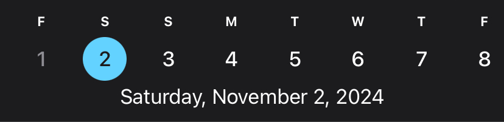
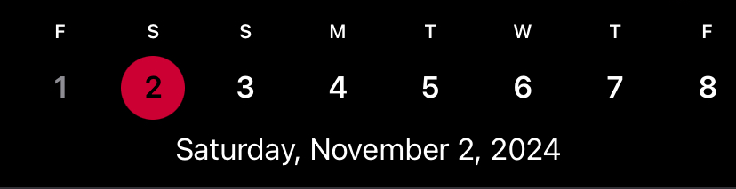

# HDatePicker
Precise recreation of the horizontal date picker from the iOS weather app. Shows one previous day and two weeks in the past.

### Inspiration


### Recreation


## Usage
```swift
import HDatePicker

struct ContentView: View {
    @State var selectedDate: Date = .now

    var body: some View {
        HDatePicker(accentColor: Color.red, selectedDate: selectedDate)
    }
}
```
